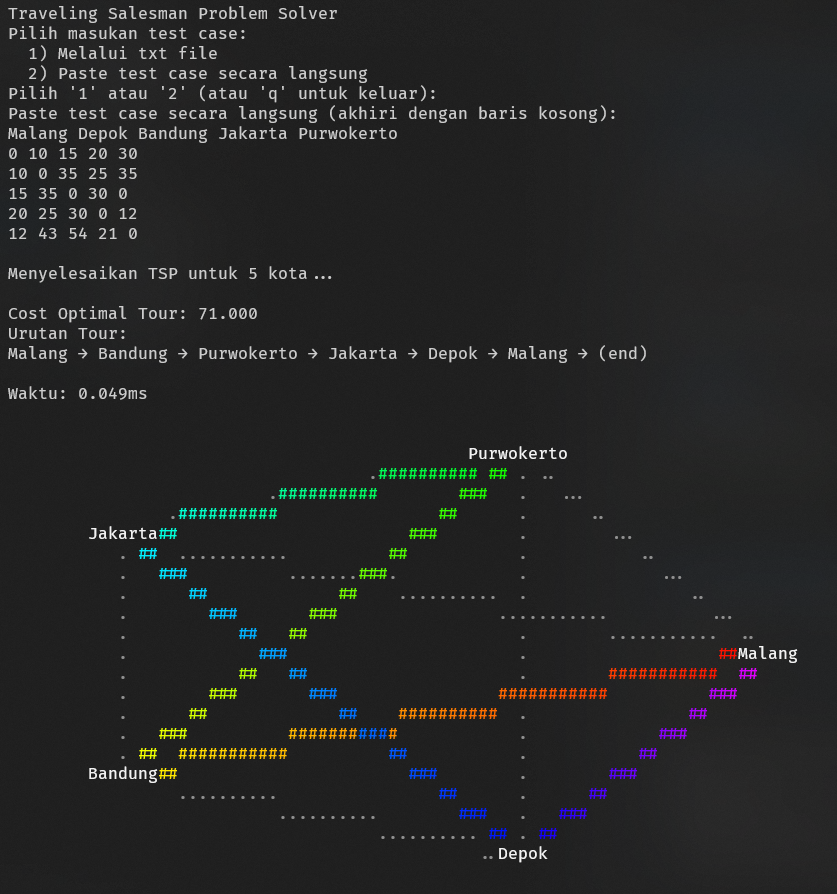

# Traveling Salesman Problem Solver

Sebuah aplikasi CLI untuk menyelesaikan Traveling Salesman Problem (TSP) secara efisien, ditulis dalam bahasa Rust, dengan fitur input file/paste, visualisasi solusi dalam bentuk teks, dan pelaporan waktu eksekusi.



## Format Input
```objectivec
CITY_A CITY_B CITY_C
AA     AB     AC
BA     BB     BC
CA     CB     CC
```
Baris pertama: Daftar nama kota.\
Matriks: Biaya perjalanan antar kota.

__Contoh:__
```objectivec
Jakarta Bogor Depok
0      10    15
10     0     20
15     20    0
```

## Cara Menjalankan
1. Build dan Jalankan:

```bash
cargo run --release
```

Ikuti instruksi pada terminal:
- Pilih metode input (file atau paste langsung).
- Jalankan solver.
- Lihat visualisasi dan waktu proses.
- Simpan hasil jika diinginkan.
